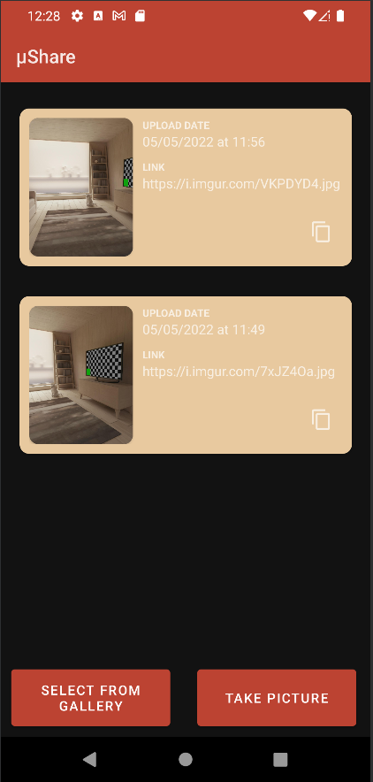

# Projekti Nimi: µShare
### Autorid: 
Hans-Märten Liiu, Markus Veem, Markus Tammeoja, Anastasija Selevjorstova ja Jan-Erik Läänesaar

 

Peamine Idee:
-------------

Luua rakendus, mille abil saad teha pilte ning seejärel need otse üles laadida, et neid hiljem on sõpradele jagada.

<h2>Paigaldamisjuhend</h2>
<ul>
  <li>Lae alla <a href="https://developer.android.com/studio">Android Studio</a>.</li>
  <li>Paigalda endale Android Studio Bumblebee (2021.1.1)</li>
  <li>Seadistage ära Android virtual device (Pixel 4 koos Play Storega + Android 12(Google Play))</li>
  <li>Lae alla Final Project kaust ja avage see kaust android studios</li>
  <li>Käivitage rakendus anroid studios, vajutades rohelisele noolekesele</li>
  <li>Rakendus peaks automaatselt käivituma.</li>
</ul>

<h2>Dokumentatsioon</h2>
<ul>
  <li>Android API 32</li>
  <li>Pixel 4 koos Play Storega + Android 12(Google Play)</li>
  <li>Imigur Client</li>
  <li>Image Conversion</li>
  <li>Image Conversion</li>
  
</ul>

<h2>Kerge oli:</h2>
  <li>Logo disainimine ja rakendusele lisamine.</li>
  <li>Dark mode lisamine</li>
  <li>Viimistlemine</li>
  <li>Koodi kommenteerimine</li>
</ul>
<h2>Raske oli:</h2>
<ul>
  <li>JSON serialisatsioon (ja veel nt Gson vs Mochi vs Jackson vs kotlinx.serialization dilemma)</li>
  <li>Piltide majandamine (ja töötlemine - nt URI konverteerimine Bitmapi)</li>
  <li>Pidi Fileprovider'iga majandama, et saada pildi URI kätte</li>
  <li>Liiga vähe dokumentatsiooni/õpetusi</li>
  <li>Imgur blokeeris ära Eesti telefoninumrid, seega ei saanud koheselt konto teha API kasutuseks.</li>
  <li>Tuli välja, et assets kaust on read-only ja on pakitud APK sisse</li>
  <li>Coroutines on vahest endiselt väga segased</li>
  <li>Recyclerview sättimine ja nendesse eventlisteneri bindimine oli alguses raske</li>
  <li>Networking on väga tüütu ja pikk (et teha POST imgurile näiteks)</li>
</ul>

## App logo

## Light Mode

## Dark Mode

## Vali pilt telefonist

## Pildistamine

