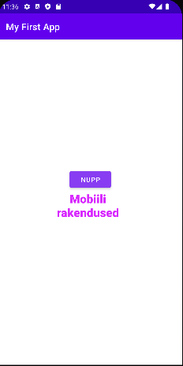

<h2>Paigaldamisjuhend</h2>
<ul>
  <li>Lae alla <a href="https://developer.android.com/studio">Android Studio</a>.</li>
  <li>Paigalda endale Android Studio Bumblebee (2021.1.1)</li>
  <li>Seadistage ära Android virtual device (Pixel 4 koos Play Storega + Android 12(Google Play))</li>
  <li>Lae alla harjutus1 ja ava see android studios</li>
  <li>Käivitage rakendus anroid studios, vajutades rohelisele noolekesele</li>
  <li>Rakendus peaks automaatselt käivituma.</li>
</ul>

Tegime Hello World rakenduse, millel asendasime Hello Worldi teksti ning lisasime juurde  nupu.

Kerge oli:

  <li>Nuppude ja tekstiväljade paigutamine.</li>
</ul>

Raske oli:

<ul>
  <li>Installeerimine</li>
</ul>

## Esimene modifikatsioon

